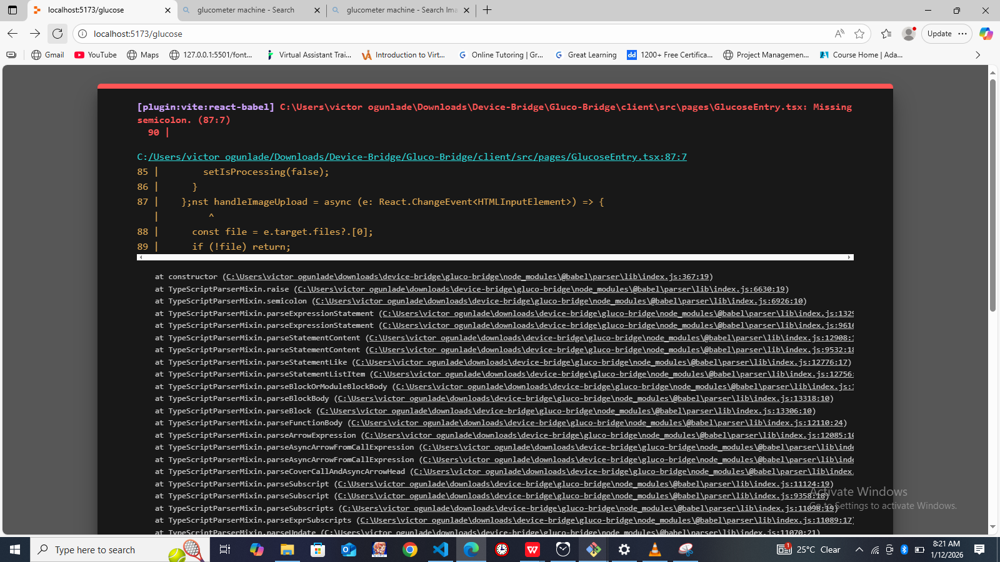

# Image Preprocessing & OCR Troubleshooting Guide

## Image Preprocessing Pipeline Integrated

The app implements a comprehensive image preprocessing pipeline to optimize OCR accuracy. Here's what happens when you upload or capture a glucometer image:

### 1. **Full Preprocessing Pipeline** (`fullPreprocessPipeline`)
Location: `client/src/lib/imagePreprocessing.ts`

**Step 1: Image Upscaling (2x)**
- Enlarges the image to 2x the original size
- Improves text clarity and makes digits more recognizable
- Uses high-quality bicubic interpolation
- Result: 256x256 → 512x512 (example)

**Step 2: Grayscale Conversion**
- Converts RGB color image to grayscale (single channel)
- Removes color noise and focus on luminance (brightness)
- Why: OCR works better on black-and-white text
- Result: Reduces color artifacts that confuse the OCR

**Step 3: Contrast Enhancement**
- Analyzes the min/max brightness values
- Stretches the contrast to use full brightness range
- Makes text darker and background lighter
- Why: High contrast = clearer text boundaries for OCR

**Step 4: Sharpening Filter**
- Uses kernel convolution (edge detection)
- Enhances edges between text and background
- Emphasizes digit boundaries
- Why: Makes each digit stand out more distinctly

**Step 5: Optional Binary Threshold** (can be enabled)
- Converts image to pure black and white (no gray)
- Uses 127 as the threshold value
- Everything darker than 127 → black, lighter → white
- Why: Removes gradients that confuse OCR

### Complete Pipeline Order:
```
Original Image
    ↓
Upscale 2x (image quality boost)
    ↓
Grayscale (single channel, reduce noise)
    ↓
Contrast Enhancement (stretch brightness)
    ↓
Sharpening (edge enhancement)
    ↓
Processed Image (ready for OCR)
```

---

## Why Your Image Might Not Be Read

### Common Issues & Solutions:

#### 1. **Poor Image Quality**
**Problem**: Blurry, out-of-focus, or low-resolution image
**Solution**: 
- Ensure good lighting (bright but not washed out)
- Hold camera steady while capturing
- Make sure screen is in focus before taking photo
- Avoid motion blur by holding still for 2 seconds

**How to test**: Upload a clear image of a printed number to see if OCR recognizes it

#### 2. **Wrong Lighting Conditions**
**Problem**: Screen reflection, glare, or shadows
**Solution**:
- Avoid direct sunlight on the glucometer screen
- Use soft, indirect lighting
- Position light source at an angle
- Clean the screen before testing

**How to test**: Try taking a photo with more light or from a different angle

#### 3. **Wrong Angle or Cropping**
**Problem**: Image is tilted, partially cut off, or too zoomed in/out
**Solution**:
- Position glucometer screen parallel to camera
- Ensure entire number is visible in frame
- Try to center the number in the frame
- Keep device level and steady

**How to test**: Make sure the entire glucose value is visible in your photo

#### 4. **Glucometer Display Type**
**Problem**: Certain display types don't work well with Tesseract OCR:
- Dot-matrix displays (old style)
- LCD displays with unusual fonts
- Very small or very large text
- Curved/warped display

**Solution**:
- Try modern glucometer displays
- Test with printed numbers first
- Use manual entry as fallback

#### 5. **Text Color Issues**
**Problem**: Text color similar to background (low contrast)
**Example**: 
- Light gray text on light background
- Dark gray text on dark background

**Solution**:
- Contrast enhancement helps, but limited by original
- Ensure glucometer has good contrast natively
- Avoid extreme lighting that washes out colors

#### 6. **Font Recognition**
**Problem**: Unusual or very small fonts
**Solution**:
- Tesseract works best with common fonts
- Fonts smaller than 8pt may be problematic
- Handwritten-style digits may not be recognized

---

## How the Preprocessing Helps

### Problem-Solution Mapping:

| Image Problem | Preprocessing Step | How It Helps |
|---|---|---|
| Low contrast | Contrast Enhancement | Makes digits darker, background lighter |
| Small text | Upscaling (2x) | Doubles the size for better recognition |
| Color noise | Grayscale | Removes confusing color information |
| Blurry edges | Sharpening | Makes digit boundaries crisp and clear |
| Gray gradients | Binary Threshold | Removes ambiguity between text/background |
| Low resolution | Upscaling + Sharpening | Reconstructs edge definition |

---

## OCR Accuracy Factors

### Tesseract.js Limitations:
- Works best with clean, clear, black text on white background
- Struggles with:
  - **Cursive fonts** (digits should be printed)
  - **Very small text** (< 8px)
  - **Rotated text** (needs to be horizontal)
  - **Colored text** (prefers black on white)
  - **Shadows/reflections** (causes confusion)

### Preprocessing Can't Fix:
- ❌ Missing digits (image cropped)
- ❌ Blurry image (pixel-level blur cannot be reversed)
- ❌ Unusual fonts not in training data
- ❌ Handwritten digits
- ❌ Text at extreme angles

### Preprocessing Works Well For:
- ✅ Low contrast images
- ✅ Small text (with upscaling)
- ✅ Color images (via grayscale)
- ✅ Images with slight blur
- ✅ Dim lighting conditions
- ✅ Non-ideal printing quality

---

## Testing the OCR Locally

### Step-by-step debugging:

**1. Test preprocessing independently:**
```typescript
import { preprocessImage } from '@/lib/imagePreprocessing';

const preprocessed = await preprocessImage(yourImageBase64, {
  contrast: true,
  grayscale: true,
  sharpen: true,
});
// View preprocessed image to see what OCR sees
```

**2. Test OCR on preprocessed image:**
```typescript
import { extractTextFromImage } from '@/lib/ocr';

const result = await extractTextFromImage(preprocessedImageBlob);
console.log('Extracted text:', result.text);
console.log('Confidence:', result.confidence);
```

**3. Test glucose extraction:**
```typescript
import { extractGlucoseValue } from '@/lib/ocr';

const glucoseData = extractGlucoseValue(extractedText);
console.log('Glucose:', glucoseData.value, glucoseData.unit);
```

---

## Recommended Image Best Practices

### ✅ DO:
- Use modern digital glucometer with LCD display
- Take photo in bright, even lighting
- Hold camera perpendicular to screen
- Keep device steady for 2 seconds
- Ensure entire number is in frame
- Use black-on-white or dark-on-light display

### ❌ DON'T:
- Use dim lighting or shadows
- Tilt the glucometer at an angle
- Move camera while taking photo
- Crop the image to only part of the number
- Use very old or unusual glucometer models
- Expose screen to glare/reflection

---

## Fallback Options

If OCR consistently fails:

1. **Manual Entry**: Switch to manual entry mode and type the number
2. **Photo Quality Check**: Verify image is clear before submitting
3. **Lighting Test**: Try with better lighting conditions
4. **Device Test**: Test with a different glucometer if available
5. **Backend Processing**: Consider server-side OCR for better accuracy

---

## Advanced Tuning Options

If you want to modify preprocessing:

**In `client/src/pages/Results.tsx` or `GlucoseEntry.tsx`:**

```typescript
// Change preprocessing settings
const preprocessedImage = await preprocessImage(imageData, {
  contrast: true,    // Enable/disable contrast
  grayscale: true,   // Enable/disable grayscale
  sharpen: true,     // Enable/disable sharpening
  threshold: false,  // Enable binary threshold (more aggressive)
});

// Or modify upscaling factor in fullPreprocessPipeline
const processedImage = await fullPreprocessPipeline(imageData);
// Internal: scale factor is 2x - can be changed in imagePreprocessing.ts
```

---

## Performance Notes

- **Preprocessing time**: 500ms - 2000ms depending on image size
- **OCR time**: 1000ms - 5000ms (slower on first run, faster after)
- **Total pipeline**: 2-7 seconds typical
- Tesseract loads WASM model on first use (~2.5MB)

---

## API Key Already Set

✅ **VITE_GEMINIKEY is configured** in your `.env` file

The Gemini API is working. If you see "API configuration error", the issue is likely:
1. Network connectivity
2. API rate limiting (too many requests)
3. Invalid API key (check expiration)
4. CORS issues (browser blocking API call)

---

## Next Steps

1. **Test with clear images**: Try capturing a printed number
2. **Check browser console**: Look for OCR errors
3. **Verify image quality**: Make sure uploaded image is clear
4. **Try manual entry**: Confirm the app works end-to-end
5. **Adjust lighting**: Improve image quality for next attempt

If OCR continues to fail, manual entry provides a reliable fallback until image quality can be improved.
